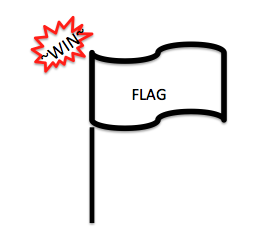
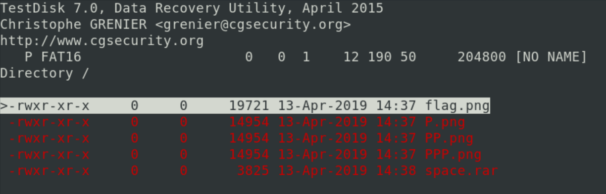
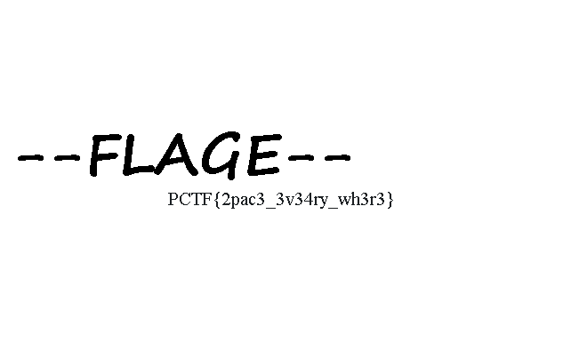

# PlaidCTF 2019

[ https://ctftime.org/event/743 ]

## Space Saver

> we couldn't think of anything cute so [here](https://play.plaidctf.com/files/space_saver-90a5a93dfdda2d0333f573eb3fac9789.dd) you go

[ **misc** : 100pts ]

As this appeared to be an genuine `.dd` file, the first step was to simply mount the disk image:

```
mount -o loop space_saver-90a5a93dfdda2d0333f573eb3fac9789.dd /mnt/tmp
```

However, the only file that could initially be found did not contain the flag despite being named `flag.png`:



Running various steganography tools against the image didn't uncover anything useful; however, the tildes (`~`) used in `~WIN~` suggested re-examining the original `.dd` and searching for **deleted** files. Using `testdisk` uncovered the following files which were duly extracted from the disk image:



The `P.png`, `PP.png` and `PPP.png` files were all identical and showed the CTF organiser's logo ([PPP](http://pwning.net/)). Again, steganography tools uncovered nothing. The `space.rar` file was more interesting, but unfortunately password-encoded.

While running some basic brute-forcing using `john`, I randomly decided to investigate the raw hex of the `.dd` file for more clues. Focusing primarily on the `P`/`PP`/`PPP.png` file data (as I was curious as to why they were hidden along with the `.rar` file), I uncovered the following near the `IEND` footers of each `PNG`:

```
00040260: 0000 4945 4e44 ae42 6082 0053 7061 6300  ..IEND.B`..Spac.
00044260: 0000 4945 4e44 ae42 6082 0033 6569 3200  ..IEND.B`..3ei2.
00048260: 0000 4945 4e44 ae42 6082 0068 6572 4500  ..IEND.B`..herE.
```

Re-constructing the suspicious looking text into `Spac3ei2herE` provided the correct password to `space.rar` and allowed `final.png` to be extracted:



Flag:

```
PCTF{2pac3_3v34ry_wh3r3}
```

## A Whaley Good Joke

> You'll have a whale of a time with [this one](https://play.plaidctf.com/files/pctf-whales_169aeb74f82dcdceb76e36a6c4c22a89)! I couldn't decide what I wanted the flag to be so I alternated adding and removing stuff in waves until I got something that looked good. Can you dive right in and tell me what was so punny?

[ **misc** : 150pts ]

Used `file` to determine that the given download contained `gzip compressed data` before extracting the contents using `tar`. This extracted a bunch of directories (each containing `layer.tar` and some other unimportant files), `44922ae2...c67ff784.json` and `manifest.json`.

I initially just decompressed all the `layer.tar` files after discovering references to `/root/flag.sh` within `44922ae2...c67ff784.json`:

```js
{
  "container": "23e9240f8ca97d3bfba72f23a57703138fb3a16d7e3e19f7d5b80d177ab50b5d",
  "created": "2019-04-13T20:58:53.322050465Z",
  "os": "linux",
  "container_config": {
    "Tty": false,
    "Cmd": [
      "\/bin\/sh",
      "-c",
      "chmod +x .\/flag.sh && .\/flag.sh"
    ],
    "Volumes": null,
    "Domainname": "",
    "WorkingDir": "\/root\/",
  ...
}
```

Unfortunately, after extracting everything in no particular order, running `flag.sh` resulted in output that was clearly not correct.

```
 $ ./flag.sh 
 pctf{1_b3tk4_auultn__s0lk3m7tr_ui2l7u_h_er}
```

A quick look at `flag.sh` showed that it was concatenating 32 files (also within `/root`) named using the numbers 1 through 32 (with later examination revealing that each file contained a single character). The fact that the resulting flag was incorrect suggested files had been overwritten, and that the **order** of extraction was important.

```bash
#!/bin/bash

for i in {1..32}
do
    test -f $i
    if [[ $? -ne 0 ]]
    then
        echo "Missing file $i - no flag for you!"
        exit
    fi
done

echo pctf{1_b3t$(cat 1 2 3 4 5 6 7 8 9 10 11 12 13 14 15 16 17 18 19 20 21 22 23 24 25 26 27 28 29 30 31 32)}
```

The `manifest.json` file (and also `44922ae2...c67ff784.json`) from the original archive confirmed a particular extraction sequence for the `layer.tar` files, however, the names of **21** of the 27 directories extracted from the archive had been masked.

```js
{
  "Layers": [
    "2354d65e014cbe530f9695dbe3faf8ac84d85d7ad91f5d46ba8ef3fc0cd88d95\/layer.tar",
    "4337e82a87b98a9c74a8328f7059baf04a2ad31081c9893c5f37d4dd85137988\/layer.tar",
    "7204dd4cdfd9b6d29a095cf1fd3b2e7efe366f191c31a75df4ea8e9f47a70801\/layer.tar",
    "c843887778784dad565b239aa712a3228d9a878f2d3f129f3ab7341a84f11910\/layer.tar",
    "????????????????????????????????????????????????????????????????\/layer.tar",
    "????????????????????????????????????????????????????????????????\/layer.tar",
    "????????????????????????????????????????????????????????????????\/layer.tar",
    ...
    "????????????????????????????????????????????????????????????????\/layer.tar",
    "????????????????????????????????????????????????????????????????\/layer.tar",
    "????????????????????????????????????????????????????????????????\/layer.tar",
    "b94e5d83dbbff95e883f0f53bcf47c017471b13d81325697be6e22cdc8c369aa\/layer.tar",
    "24d12bbeb0a9fd321a8decc0c544f84bf1f6fc2fd69fa043602e012e3ee6558b\/layer.tar"
  ],
  ...
}
```

The `layer.tar` files from those particular directories also happened to specify only revisions that added or deleted different numbers and combinations of the 32 files comprising the flag within `/root`. This step did require some searching to discover that `.wh.` files are special **whiteout** files used by Docker to represent file and folder deletion.

Using the above knowledge and the clue within the challenge description about `alternated adding and removing stuff`, I eventually realised that it might be possible to determine the correct extraction order based on the following two principles:

* No file can be deleted that doesn't exist (ie, it must be added first)
* No file can be added that currently exists (ie, it must have *not* been added yet or needs to be deleted first)

The code in [ [a-whaley-good-joke.py](a-whaley-good-joke.py) ] creates a tree structure of alternating `ADD`/`DEL` revision nodes that explores sequence orders of extractions which satisfy the above rules. A valid sequence order will have a tree depth of 21 (ie, using all the possible revisions). The script then extracts the files based on each valid sequence ordering and displays the potential flags. 

There were actually 24 valid revision sequences combining for an assortment of possible flags:

```
Processing valid sequences ...
Extracting sequence #00 : pctf{1_b3tttzalkzgn_7s0lknq6___ui2l_u_h_er}
Extracting sequence #01 : pctf{1_b3tttzalkzgn_7s0lknq6___ui2l_u_h_er}
Extracting sequence #02 : pctf{1_b3tttzalkzgn_7s0lknq6___ui2l_u_h_er}
Extracting sequence #03 : pctf{1_b3tttzalkzgn_7s0lknq6___ui2l_u_h_er}
Extracting sequence #04 : pctf{1_b3t_u_couldnt_c0nt4in3r_ur_l4ught3r}
Extracting sequence #05 : pctf{1_b3t_u_couldnt0s0nt4in3e_urel4ught3r}
Extracting sequence #06 : pctf{1_b3t_u_couldnt0s0nt4in3e_urel4ught3r}
...
```

The correct result was determined by simply seeing which of the flags made sense:

```
pctf{1_b3t_u_couldnt_c0nt4in3r_ur_l4ught3r}
```
